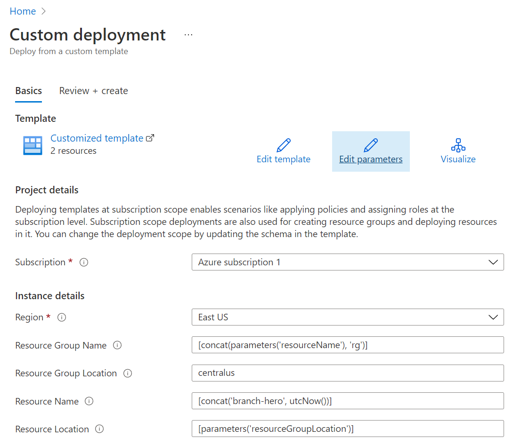
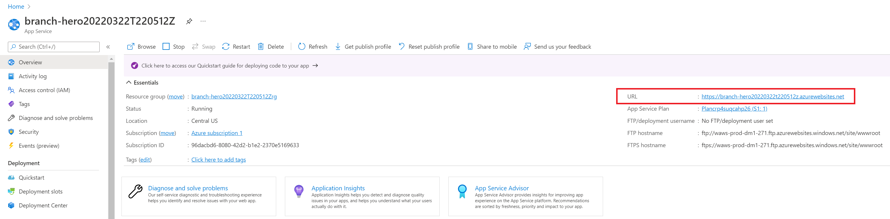
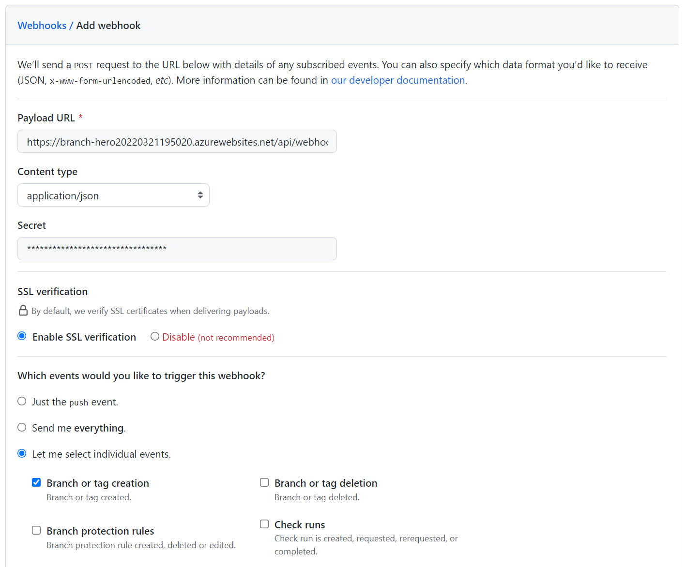
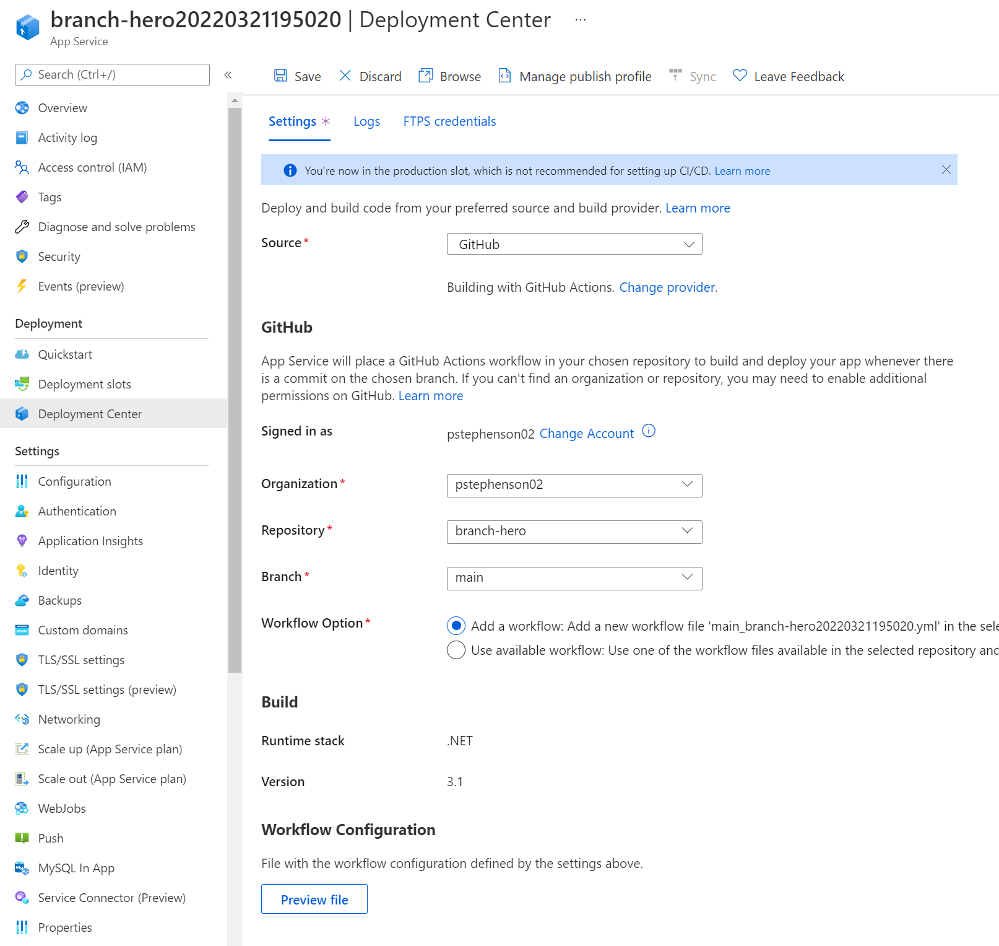
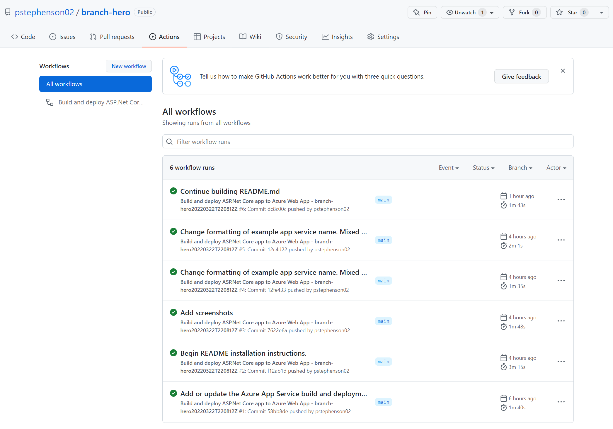

# Branch Hero :guardsman:

Branch Hero is here to protect your GitHub repository default branches across an entire organization. It automatically applies the following GitHub branch protection rules for all new default branches across repositories in an organization:

* Require pull request before merging
* Require at least 1 approval before merging
* Dismiss stale pull request approvals when new commits are pushed

## How It Works

Branch Hero works by listening for two specific repository events:
* When the **first branch in any new repository is created**. By convention, the first branch in any new GitHub repository becomes the default branch (even if the organization is configured with a different default branch name).
* When the **default branch for any repository has been changed**.

**Caveat**: If a default branch change occurs, BH will first check if there already exists a branch protection rule for the new default branch. If one already exists, BH leaves this alone and does nothing.

## Prerequisites

* An Azure account. [Sign up for free](https://azure.microsoft.com/en-us/free/).
* A GitHub organization. [Sign up for free](https://github.com/join).
* A GitHub user with admin access to the organization.
* A Personal Access Token under your GitHub account with the **repo** scope. See [GitHub's documentation](https://docs.github.com/en/authentication/keeping-your-account-and-data-secure/creating-a-personal-access-token) for how to create one.

## Installation

The simplest way to run Branch Hero is to follow these instructions to deploy an instance of the service into Azure.

1. Start by creating a fork of this repository. In the top-right corner of the page, click **Fork**.

2. Next, click the **Deploy to Azure** button to deploy the Azure infrastructure:

 
You'll be prompted first to login to Azure. Then, you should see the following page:

 
The default values will create a unique name for your instance, but you can of course change these to your liking.  
Once your deployment is complete, use the Azure search bar and find your new Azure App Service. If you used the default settings above, your App Service name should look something like: <b>branch-hero20220322T220512Z</b>
 
On the App Service page, take note of the public URL. We'll need this in our next step. Leave this page open as well. We'll return to it right after Step 3.
 

3. As your GitHub user with admin access to your organization, go to [your organization's settings page](https://docs.github.com/en/organizations/collaborating-with-groups-in-organizations/accessing-your-organizations-settings). Find the Webhooks section, and [create a new Webhook for your organization](https://docs.github.com/en/developers/webhooks-and-events/webhooks/creating-webhooks).
    * In the Payload URL field, use the URL to our new Azure App Service from the previous step, plus the route suffix: /api/webhooks. For example: **https://branch-hero20220321195020.azurewebsites.net/api/webhooks**
    * Change the Content type from **application/x-www-form-urlencoded** to **application/json**
    * For the Secret field, enter a random sequence of characters. It's best to use a completely random string with high entropy. This string will be used to secure your instance of Branch Hero's public facing API. **Keep track of your secret** - you'll need it soon to configure your Branch Hero app. [Read more about the Secret field here](https://docs.github.com/en/developers/webhooks-and-events/webhooks/securing-your-webhooks#setting-your-secret-token).
    * Under the question: **Which events would you like to trigger this webhook?** Select the option **Let me select individual events.** Branch Hero only acts upon two event types:
        * **Branch or tag creation**
        * **Repositories**
 Select these two and you can remove any other predefined defaults. 
    * Scroll down and make sure the Active checkbox is checked, and click <b>Add webhook</b>.

4. Return to your Branch Hero Azure App Service page from Step 2 (where we found the URL). In the navigation menu on the left, find **Configuration** under the **Settings** section. Add two new **Application settings**:
    * GITHUB__TOKEN - This should be your GitHub Personal Access Token (see [Prerequisites](#prerequisites))
    * GITHUB__WEBHOOKSECRET - The secret you created when setting up your GitHub Webhook.
**Important**: Notice there are **two** underscores (_) in these config keys.
Remember to click **Save** after creating your Application Settings.

5. Finally, let's deploy the code. Again from the App Service page, find the **Deployment Center** under the **Deployment** section in the left nav.
    * In the Source field, select **GitHub**. If you're setting this up for the first time, you'll need to click **Authorize** and delegate access to your GitHub account to Azure.
    * After authorizing your Azure account with GitHub, select the **Organization** and **Repository** where you forked branch-hero from Step 1. Select the *main* **Branch**.
    * Leave the rest of the options as-is, and click **Save*.
  

At this point, Azure will commit a GitHub Actions workflow file and a GitHub Actions build should kick off from your forked repository and actually deploy the code. You can verify whether this worked or not by going to your repository homepage on GitHub and clicking on the **Actions** section:
  

If your actions build was successful, that's it! You've successfully deploy Branch Hero and are officially protected :) If you happen to make any changes or commits to your new forked branch-hero repository, this GitHub Actions workflow will build and deploy the app again each time to your Azure App Service.

## About Me
Hi there! I'm Phil, the author of this project. I'm a former software engineer turned solutions architect. Thanks for checking out my project. If you have any feedback or suggestions, send me a note (my email is in my [profile](https://github.com/pstephenson02)) or create an issue on this repo. I'd love to hear from you. Cheers.