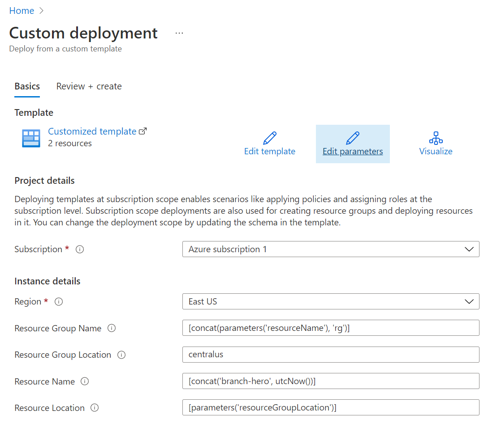
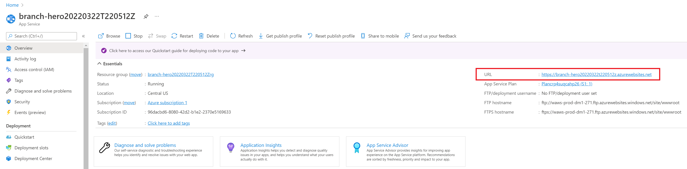

# Branch Hero

Branch Hero is here to protect your GitHub repository default branches across an entire organization.

## How It Works

Branch Hero works by listening for two specific repository events:
* When the **first branch in any new repository is created**. By convention, the first branch in any new GitHub repository becomes the default branch (even if the organization is configured with a different default branch name).
* When the **default branch for any repository has been changed**.

If either of these events occur, Branch Hero will apply a new branch protection rule on the default branch.

**Caveat**: If a default branch change occurs, BH will first check if there already exists a branch protection rule for the new default branch. If one already exists, BH leaves this alone.

### Prerequisites

* An Azure account. [Sign up for free](https://azure.microsoft.com/en-us/free/).
* A GitHub organization. [Sign up for free](https://github.com/join).
* A GitHub user with admin access to the organization.

## Installation

The simplest way to run Branch Hero is to follow these instructions to deploy an instance of the service into Azure.

1. Start by creating a fork of this repository. In the top-right corner of the page, click **Fork**.

2. Next, click the **Deploy to Azure** button to deploy the Azure infrastructure:
 

 
You'll be prompted first to login to Azure. Then, you should see the following page:

 
The default values will create a unique name for your instance, but you can of course change these to your liking as well.  
Once your deployment is complete, use the Azure search bar and find your new Azure App Service. If you used the default settings above, your App Service name should look something like: <b>branch-hero20220322T220512Z</b>
 
On the App Service page, take note of the public URL. We'll need this in our next step.
 
